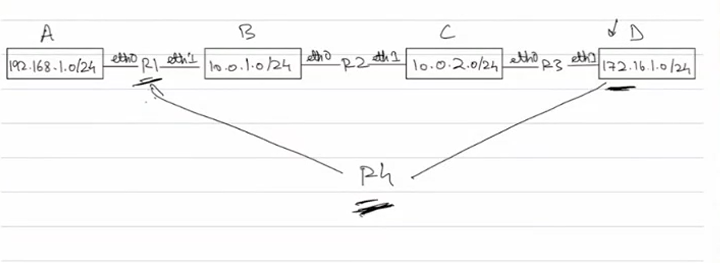

Why are static routing tables bad?
For complex network we might make mistakes, even if we are error less its time consuming and we would have to continuosly keep monitoring our networks if any link is failing or if there is a lot of traffic in between, we need to update the table to add a new path/route, so we need some kind of algo/protocol

Some of these dynamic protocols are:
1. RIP(routing info protocol)
  
2. OSPF()
3. IS-IS

There are more protocols that exist since these only work in an intra domain way(within an autonomous system)(will talk about what this is later)

You can also make static entries in these tables that use dynamic protocols but we usually dont do it sinc they take care of it

## RIP
Each and every neighbouring router talk to each other continuosly and share whatever they know about their routing table

RIP needs to have some metric based on which it decides what the best path is, so it uses only the hop metric, how many hops away is the current router from dest while taking a specific path

This is not very great since it dosent consider current traffic or bandwidth of the router etc 

(it is possible for a network to be connected to mutipe routers simultaneously, in this case which router does a device send info to ?)

Lets see how RIP works with this example(new metric  and next hop cols have also been added)(hops are counted only b/w routers)

#### Initial State

Now each neighbour talk and tell each other what they know, Lets assume R1 talks to R2, R2 talks to R1 & R3, R3 talks to R2

#### First round of info exchange

A router checks the network info shared to it, if its not available in its own table it adds it keeping the router that gave it info as the next hop

#### New state of routing table 

A device in network A still cant send data to a device in network D and vice versa

After a set amount of time(20 30 seconds) the info exchange takes place again

#### Next state of routing table

How do routers even know about their neighbours, how does one router know that there is another router connected to the switch?
Broadcasting, its not always broadcating but in this case RIP version 1 it is, they send RIP messages to each other like i am R1 with this interface running RIP protocol, any router running RIP that receives this message makes a note of it, i RIP version 2 every router sends a message to a specific ip addr and every router is listening on that ip addr

Lets add a R4 to the above network which is connected to network D and R1, in R1's routing table the current route to network D required 2 hops but with the addition of R4, it communicates with R1 saying it has a direct connection to D, so R1 updates the path by overwriting the earlier path

Routers keep running shortest graph algos to relax the edges and find the best path, so which algo bellman ford or djikstra?
A router is aware about all the networks and routers but is not aware of the entire topology of the network, but only about the next hop. In bellman ford we are relaxing edge by edge where it does not really matter what the ordering here is, a router only cares about relaxing the edges its directly connected to, yes it does relax info it receives from others but the router receives the info from its adjacent edges, the router does not care whats beyond its directly conneted ones

Obvisously having all routers from our laptop to lets say google server is not feasible due to extremely large routing tables that get created and also because there is one main chain of routers from here to google servers, what we have are a bunch of relatively small networks called Autonomous Systems/Zones(AS)

### Autonomous Systems
Bunch of device connected to each other that is controlled by one entity

RIP is run within these systems and only they exchange info with each other, when the edge of a system is reached by a request going to google servers, the process is simply handed off/forwarded to the next AS using certain protocols(research about them like BGT and all ), ofc we can have AS inside AS using certain protocols

This is not the main reason why AS exists, its not like one provider can control all the routers on earth, so the whole internet is a bunch of connected AS

RIP is a intra domain/AS protocol meaning it only works withinn the domain

Problems in RIP(why we dont use it anymore)
1. Only considering hop metric
2. If a route fails, other routers gotta be aware of that, so during the next cycle of RIP the router adj to the failed router removes the entry from the routing table and it takes time for this to propagate and reflect in all routers, so for that period of time you cannot send data through that path and we dont have an updated route which is bad
3. There exists a max hop count of smtg like 15 beyond which it removes the entry saying its too far away

## OSPF(Open Shortest Path First)

In RIP did not have knowledge of the entire topology, but in OSPF each routers shares with its neighbour and has the knowledge of the entire topology, we consider other metrics like bandwidth current traffic response time etc, in reality ospf only considers bandwidth so vendors/providers include a layer on top to add other metrics to the cost

In 2nd step, routers share their link states(link state announcement) which is the state of the links of the router like A and B for R1 and is working, R2 after receiving link state from R1 forwards the link state of both R1 and R2 to R3 and so can build a complete map of how everything is connected

Then they share their routing tables like we saw before

The difference with RIP is that we now have the complete path and the metric cost is diff

THe advantage we get by having the entire topology is that is a router breaks down somewhere, each router does not wait to propagate its routing table one by one, the router does something called a LSA flooding and starts sending a message to all routers continusly saying that the link is broken and sharing the updated link state, now the src router can calc the shortest path on its own and then send the data without delay, we dont have to dpend on other routers and ultimately the routing tables also do get update

Here we can use djikstra

OSPF is more cpu and memory intensive than RIP

OSPF is intra domain and also divides AS into multiple areas and a area 0 called backbone which every area is connected to

