# NAT

A network is split into many regions of private networks containing a router who has a public ip, so 2 diff regions can use the same ip addr since they are private networks, now if we want to talk to a public ip like google, it receives the private ip as the src and simply cant respond to it since the private ip does not make any sense for a public server due to the millions of device sharing the same private ip, due to this issue we introduced NAT that is running at every router which takes the private ip and sets the src as its own public ip and then forwards it, the router now receives the response from the google server and forwards it to the specific device that requested

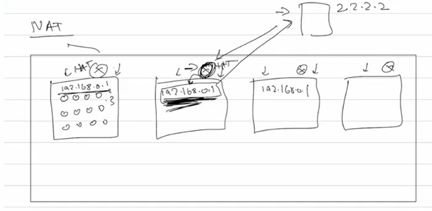

NAT has to maintain mapping/table for this to work, so lets look at a rough version of it

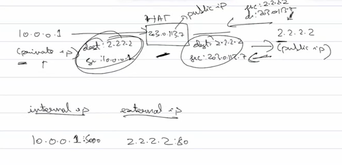

This table leads to conflicts when 2 devices send a req to the same dest , how will it know if the response is for device one or two

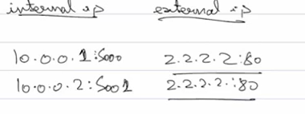

When NAT makes a connection outside it also has to be using a port, so that can be used to differentiate between responses. Now which port should NAT use? The same port no. as the src or something else?

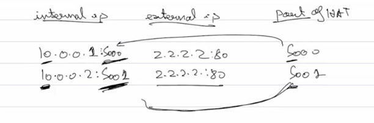

Okay but now what if another device sends a req with the same port no. as the other, theres an ambiguity again, first of all since the port is already in use it cant even use it but even if it was possible now the NAT dosent know who to send which response

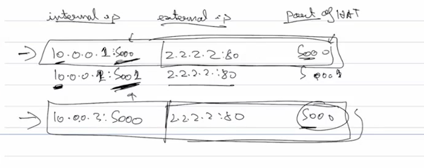

So we use a temporary/empheral port for each req

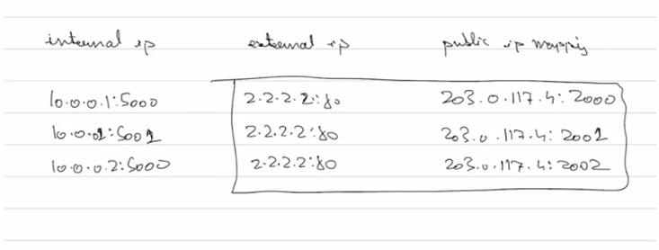

(public ip mapping is just the ip of router with its port number)

NAT maintains the mapping for a few seconds and when responses stop coming it deletes it, but what if a middle man or a hacker found out about the mapping in the NAT table during this time and sends a req to the private ip to the router, should the router forward this to the private ip or should it check if the src of the response is the same as the dest of the req? 

Both types of NATs exist

The diagram gives an idea of why its called a cone

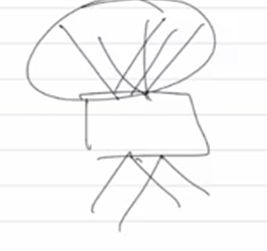

1. Full Cone NAT(As long as mapping exists forwards requests to the private ip when the router ip port combo is hit)(less restrictive)

2. Restrictive Cone NAT

### Problem with NAT

How do we establish peer to peer network?
Usually two clients talk to each other through a server 

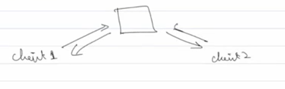

In p2p networks the clients are connected directly with no server in b/w, ex: torrent, skype(early version)

Lets take an example assuming full cone NAT

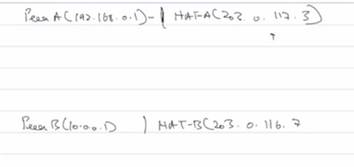

At this momment with no req the NAT is empty, peer A cant talk to peer B (the direct conn is true p2p btw)since they are not on the same network, so A makes a req to NAT B, but when this req reaches NAT B, the table is empty so it will just reject the req

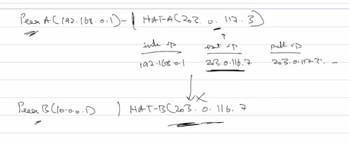

One soln is to manually add an entry in B, and obviosuly thi aint a good soln

This is solved using STUN servers

#### STUN(Session Traversal Utility for NAT)

Special servers created to let a device know what its public ip addr looks like from the internet

A sends a req to the STUN servers, so the NAT is updated with this mapping and the server reponds with A's public ip(router ip with port), for now lets assume A & B know about the stun server's ip

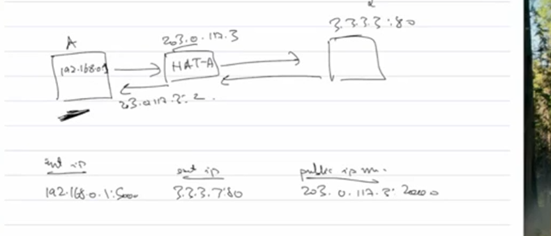

B does the same

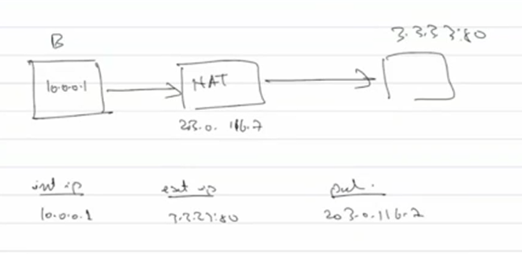

Now A and B can send data to each other, that is all in the case of full cone NAT

Alr but how do A & B know each other's public ip?

We have other Signalling servers where they ask the other device's ip and provide thier own

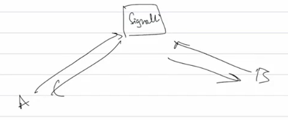

Above setup wont work for restrictive cone NAT since the mapping is for the device and the STUN not A and B so the req is rejected 

This is a bit tricky to solve so companies usually just put relay servers in between when clients talk to each other through a server or one port on the NAT is exposed who forwards all data recieved without checking the src(port forwarding)

#### Hole Punching 

Both devices try to send a req to each other at the SAME TIME hoping which will arrive to each other's NAT at a specific time and seem like a response to the original request, and since NAT cannot differentiate it accepts

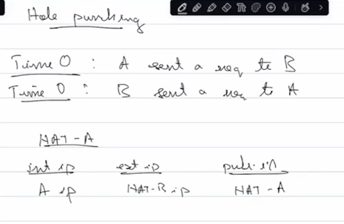

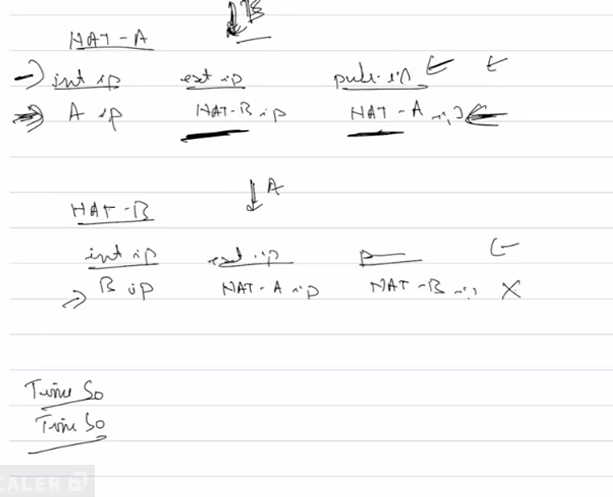

It does not have a 100 percent success rate so it takes multiple tries to establish this connection

