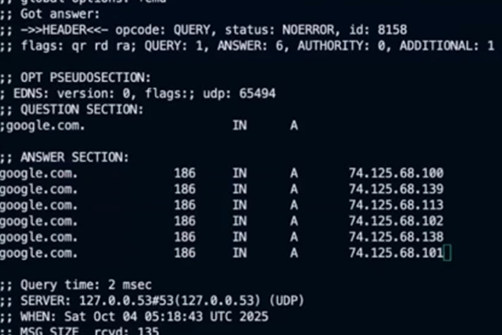
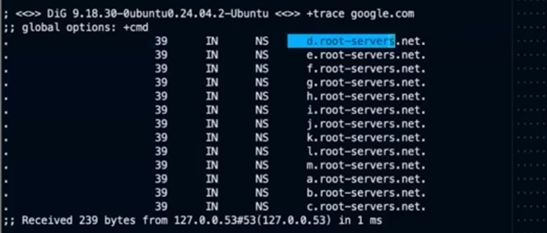
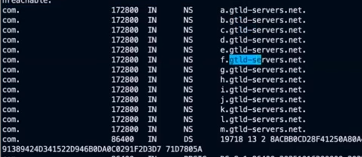
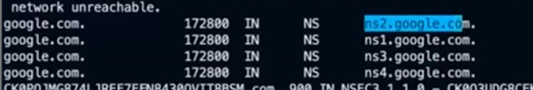
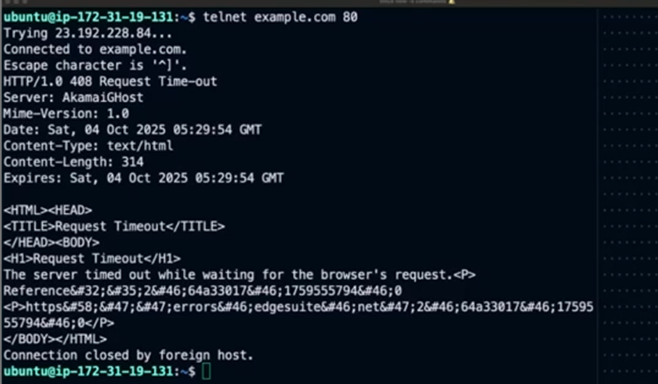
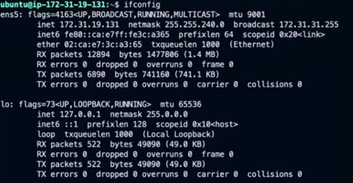
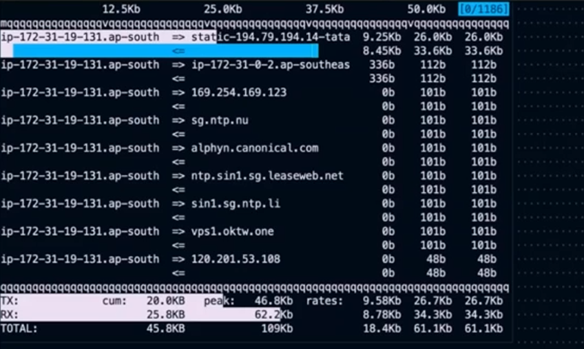
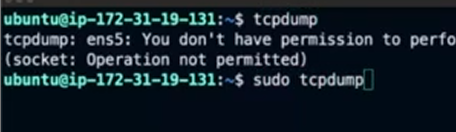
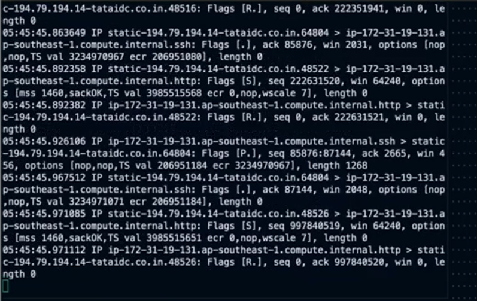

1. dig

- hits dns server recursive resolver and fetches final ip
- works in a query ans fashion

- The number 186 is the TTL for cache and IN means internet, A means records of mapping(discussed in dns)
- used by dev ops engineers to see if dns mapping has happened or not

- trace traces the whole flow of dns

root servers

tld

ans

google servers

2. nslookup

- simpler version of dig

3. host 

- even simpler version of dig

4. telnet

- creates a tcp conn with a remote server and then we can communicate with it using http

5. ifconfig(interface config)

- shows all network interfaces on system

6. iftop

- shows the amount of bandwidth that is getting utilised for every conn trying to tLalk to our system

- good tool to figure out if someone is unnecessarily trying to hit our servers

7. tcpdump

- what wireshark was but without gui, captures all data packets coming on all interfaces

