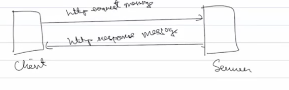
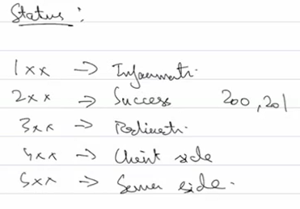
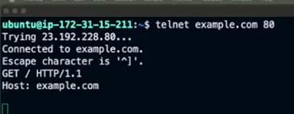
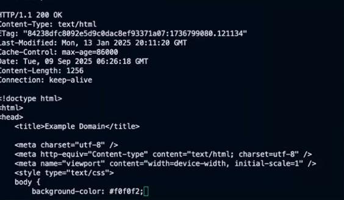
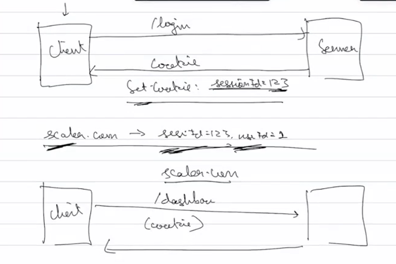
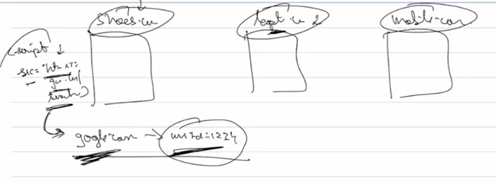
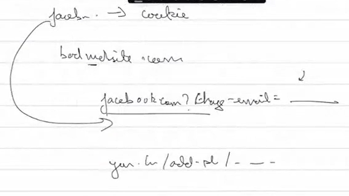
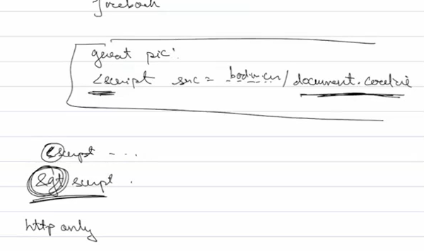

Networks among universities -> Lets connect them -> WWW 

Idea behind WWW was to have connected devices around the world and info shared b/w them is through hyper text(documents have links to other documents along with the regulr data) documents, this is also when HTML(markup means like tags we use in HTML) was invented which the document swould be composed of.

Now how do we access these documents, we dont wanna see tags and all we want it to be pretty?
Browser was invented in which we enter a domain name for the document to be fetched from a server and now we need some kind of protocol b/w browser(client) and server side to fetch this particular data

HTTP was invented, but why another protocol why not just use TCP?
If internet has to be widespread it has to be as simple as possible not just for end user but for devs to be ble to create websites and all easily so HTTP was created at the application layer and is text based(it gets converted to bytes and all in lower level but we interact using text so entry level barrier is low) and devs dont need to have extensive knowledge of networking to work with http

Smothing like node literally takes the http message and parses it line by line first word should be this second this etc then packages it into a good api and gives it to us

## HTTP Request Message

1st line -> Method, resource(what kind os document path of document), http version
2nd line -> Headers(dosent contain things like src dest ip and port since all of those things is already being taken care at the tcp layer)(we can put whatever header we want but there are some common headers that are always present as mentioned in the example below)

Ex: 
GET /example.html HTTP/1.1
Host(actual url of the server we want to hit): google.com
Connection: close/keep-alive
User-Agent(Identification of where the request is originating from, server coud change reponse based on browser and version): Chrome-1.50.60
Accept-lng: eng

## HTTP Response Message

Server sends version cause incase there is a mismatch in version between server and client the server can downgrade or usually the client upgrades

HTTP/1.1  200 OK(status code)
Connection:
Date:
Content-Type(HTML,JSON):text/HTML or application/JSON
(data)

## HTTP Messages

GET - fetch
POST - create new resource
PUT - update
PATCH - partial update
DELETE - delete
These are just conventions, no hard rule where you have to follow these for these methods

Telnet cmd allows us to establish a remote tcp connection with a server and on top of this we can communicate to the server using http, something similar to what browsers do even if they do not specifically use telnet

## Persistent and non persistent connection

Client asks for the index.html page ad server reposnds back with it but the html also contains links to css and js so browser has to fetch both of them, how this another request is made is determined by if our connection is persistent or non persistent, like do we use the same index.html tcp connection for the new request(persistent, the connection does not close with response it persists) or do we create a new tcp connection

This behaviour is controlled by the connection header, persistent -> keep-alive, and close is non

## Statelessness

HTTP is a stateless protocol(no inbuilt mechanism to remember previous request, each request is independent and expects complete data)

After we login to a website and send the next request to get dashboard, http does not remember about the previous request so it doesnt know who you are so why would it send you data?
Sending username and password with each request is a bad idea so we use cookies

## Cookies
Small piece of data that server sends to a browser which the browser then stores and sends with future requests, contains something that helps uniquely identify the client

Cookies are also used to track people across websites, nowadays not so common

When we logout cookie becomes invalid
Another reason why sending username and password is not a good idea since someone manages to steal cookie we can invalidate by logging out but same not true for the other

## Common security issues

1. Session hijacking
Cookie is stored in our browser but if we give the cookie info to another laptop's browser, when they visit a website thye would login with our details

2. CSRF attacks(cross site request forgery)
A bad website can make a call to a good website on our behalf and our browser might automatically attach a cookie to it and cause problems

can be solved by sameSite=strict, if a website loads and tries to make a call to another website the cookie wont work on it

3. Cross Site Scripting

