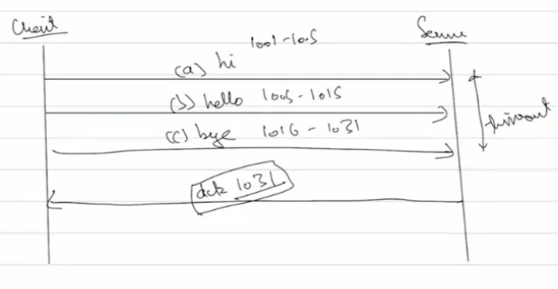
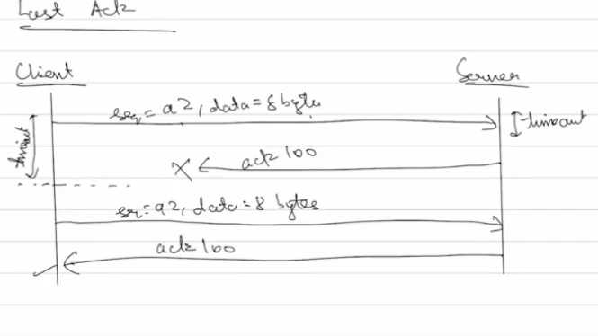
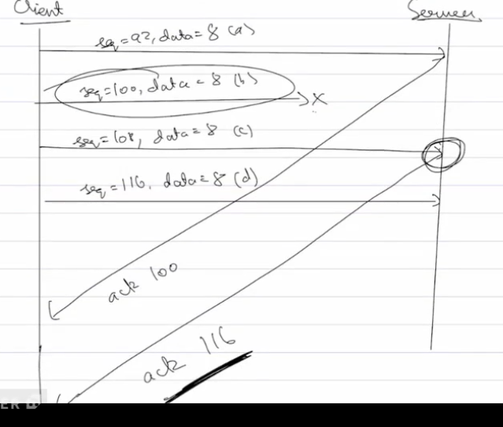

Ex: server supposed to only send back ack and client wants to send hi hello bye

but now during the 3 way handshake ack, why do we use 1001 and not 1002 or 1003 are we not considering the byte size of sync packet or are we considering it and it is 1?
Server and client are not considering size of packet, get seq no add 1 to it and return ack no. thats all

Optimizations

1. Cummulative Acknowledgement
Do you think its going to be a very good algorithm if a ack packet is sent back for every packet sent? If there are thousands of data packets then there's an additional thousands of ack packet making it slow and transfer a lot of extra data for no reason, so TCP uses Cummulative Acknowledgement, instaed of sending ack immediately it waits for a certain amount of time(timeout) allows for more data to come and sends just one ack no. whose final ack no. would be the last byte of all the data received+1

The timeout is continuosly updating timeout value based on no. of packets received. how is it being updated whats the algo behind it ?
The receiver also has timer where it waits for a certain amount of time where if not received a ack packet then resends the packet

2. Piggy backing
Lets say now server wants to send bye after receiving hi hello bye instead of sending a separate data packet after the final ack packet, it just combines it with the ack packet using piggy backing. Piggy backing the data on the back of ack

Scenarios

1. Lost Ack

Lets say server timeout is very small so it expired and sends back an ack after receiving data and ack packet didnt reach client. Now the receiver also has a time out where it waits for a certain amount of time where if not received a ack packet then resends the packet, now sender realises maybe ack packet got lost and sends same ack back

2. Delayed ack

Ack came back to receiver but its timeout expired before ack could reach and sends back the data packet, sender now says i have received the same data before and the second packet as well(receiver side always keeps this info in memory its not like they drop the packet, its contiuosly buffering) and have sent back ack so probably ack didnt reach or got delayed and since it alreaddy has both data it just sends back one ack no. with the ending byte+1 of the last data it received

Client realises it resent only one packet but received the seq no. of both combined so the previous packet had also reached

Same is applicable with lost ack also

If we used numbers instead of bytes like now we would have the uncertainty of what is 1 or 2 or 3 etc what if some ordering problem is there so better to use bytes

3. Fast Transmission 

Since sever(short timeout) has not received data from 100 to 108 it cannot send back he ack 116 after receiving the 3rd packet since that would mean received everything upto 116 which is not true, server has 2 options:
  Keep waiting for middle packet eventually timeout expires and client sends it back

  Other thing that actually happens is that even though it receives 3rd packet and 4th packet, server sends back ack 100 again for each packet received, if server sends back same ack again and again no matter what client sends, after 3 times client understands somewhere a packet got lost, so client dosent wait for timeout, it immediately resends data with the seq no. of ack no.
 
 

 and now once server receives the missing packet it can send bak the last byte of all the received packet + 1 so that client dosent resend the already received packets

 

 imp shi
 