# IP addresses
Unique identifier for devices connected on the internet

Our laptop can also be considered a server albeit a really bad one, so lets say we create a node js application and we run it on our device so it can be considered as running on a server and can server traffic, so can we use the ip address provided by our laptop for people around the world to hit the server will the application running on our laptop be exposed to the world?
No

## Public and private addresses

1. Private ips are ips that can be used within a private network(on higher level you can consider the netwrok of connected devices in your home or a private network created by the routers in a classroom, this netwrok cannot be directly accessed from the outside)
private ips do not make any sense outside their private networks

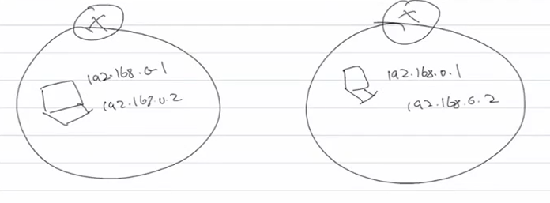
2 two devices in 2 diff private networks can have same ip addresses

Private IPs have a range(18 million) 10.0.0.0 - 10.255.255.255, 172.16.0.0-172.31.255.255, 192.168.0.0 - 192.168.255.255(most common), most ips outside this range are public ip addresses with a few exceptions

questions to be answered, what if we do actually try to hit a private network from a public network what happens

2. Public IPs are globally unique IPs

Cannot repeat even if used in a private network

How the concept of private networks is used to resolve the limitation of number of ipv4 addresses?
  Lets say airtel wanted to provide ip addresses to people around the country and bought 1 lakh ip public addresses and provided one to each customer, is this a good solution?
  No, one of the reasons are that there are a limited number of addresses(fun fact all ipv4 addresses around the world have been exhausted), so such companies make use of public and private ip addresses to solve this prticular problem
So oversimplyfying, such a company with 1 lakh ip addresses would divide the country into 1 lakh regions and for each region they have one big powerful router to create a private network, for these routers they assigned a public ip address,within this private network the people who want to connect to the internet, thier device is connected to the public router and then assigned a private ip 
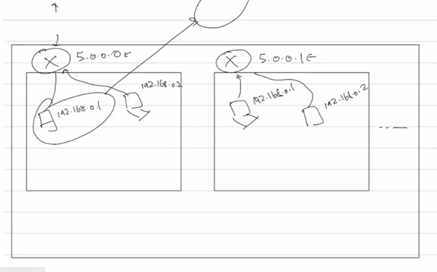
but this soln brings problems
  1. How will 2 devices in diff regions talk to each other?
  Will see the ans in further classes
  2. How are our devices in private networks going to talk to devices in the public network since the private ip dosent make any sense outisde its network?
  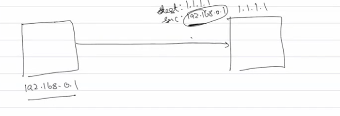
  If we try to talk to goggle servers with our src ip as our private network ip then the server cant even respond since there are prolly thousands of devices around the world with the same private ip

  So we need to have some publically reachble ip addr for the private network, where the req/res goes to the publically reachable ip and then it figures out how to take it forward

## NAT(Network Address Translation)
 Allows a device on a private network to talk to a device on the public network
 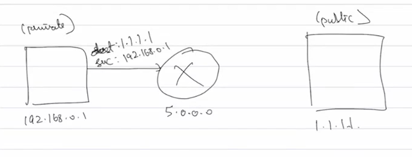
 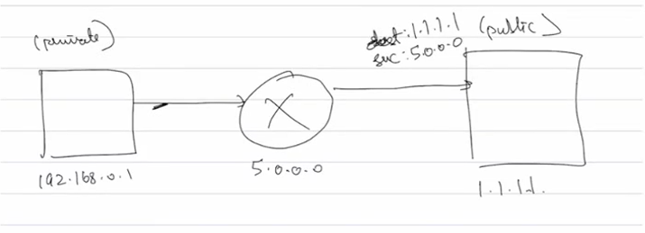
 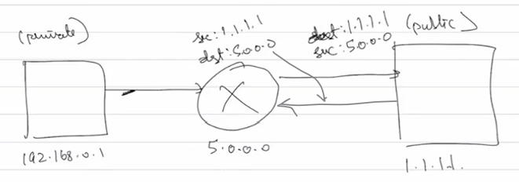
 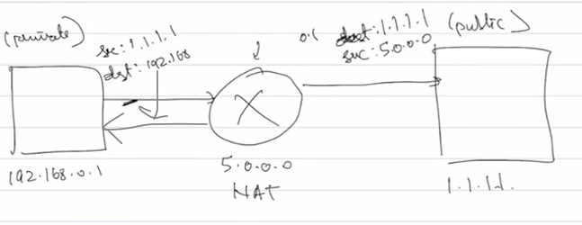

 The nat maintains a table so that the response is served to the device which requested it

 All these will be discussed in detail in further classes
 Nat still does not solve problem number 1 cause how will it even know in which region the other ip address is in

The above solution can be applied to smaller and smaller chunks of regions like my laptop is not directly connected to an airtel router its connected to my local router(and it also wouldnt be effiecient for all devices to connect to big roiter anyways)
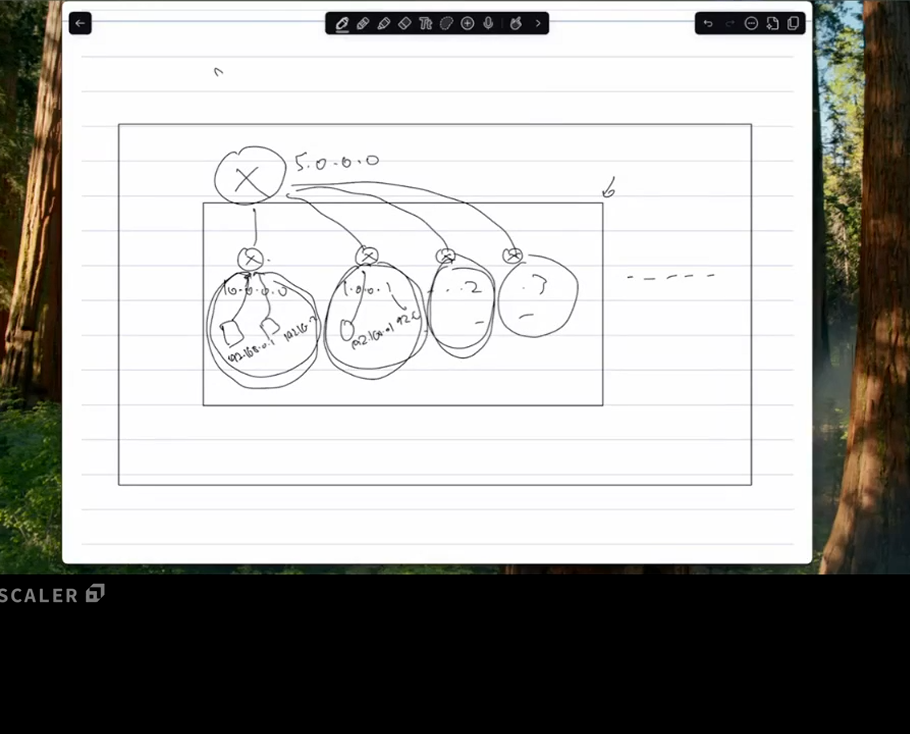
So our devices are in a private network of our local router which is itself in the private network of a biger router, all these routers implement NAT, also once an ip is used in a layer its children cannot have same ip
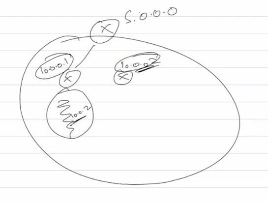

If we have this the why do we need ipv6?
1. This is just a workaround ipv4, cause all the nat and all has a overhead of its own which would be less if we switch to ipv6, we can have fewer such layers
(i feel like having all these layers before being exposed to the public net makes this harder to hack, am i wrong? is it true? if yes isnt it good that we have this? does having multiple layers even have an effect on that?)
2. Peer to peer connections of device in 2 different regions is not directly possible on NAT, there are workarounds(stun servers) but they also have thier own overheads, so if ipv6 comes we dont need nat due to the sheer number of IPs  that exist

Considering what we have discussed so far, we see that there is router which creates its own private network which is technically correct, but in network world we assume the router to be a part of that private network and the network itslef is assigned an ip address which is not the router's ip address(keep this info in the back of your mid dosent make any sense rn)
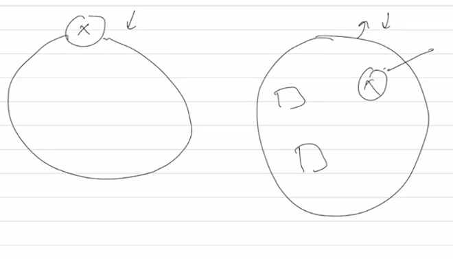

## Host & Network Part of an IP

Till now whenever we discussed private networks, we say that all IPs had a common prefix, can we create another device in this network with a IP of a different prefix? No, every IP in a private network will have some common prefix with some bits of information, these first few bits are the network part. Also this is not fixed, we decide how many parts are of network and host

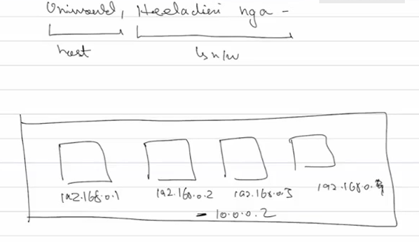

If we consider first 24 bit to be network part then the first 3 numbers will be network and the last one is host part, for a network the network part wont change it remains the same, that means 256 devices can connect to this network, in reality its 254 but we'll understand why this is the case later
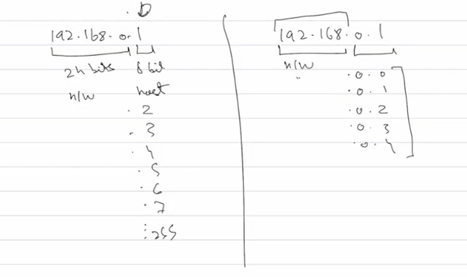
Network parts anrent limited to 8 16 it can be any number of bits till 32

#### Network (general network to which the device has been connected to)

#### Host(actual host that is a part of the paricular network)

1. Why this divison?
 Using this division devices and routers can make the decision on where to actually send the data
 Two devices on the same network can talk to each other directly, we might assume that data goes from our device to router and then to the dest but that does not happen, laptop will directly talk to the other device
 Each and every device on the network knows whats the network and host part, the how is covered in the next class
 
 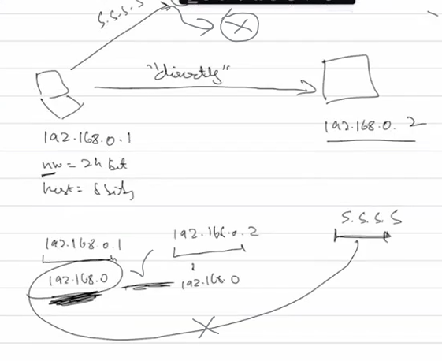

 This is why the division exits, if the sender knows that receiver is on the same network then it will communicate directly otherwise it has to send the request via the router

2. How is this division happening which part is network and which is host(how do we know how to make this division)?

Made based on specific requirements of an organisation depending on thier size and other factors like a huge comapany might need lots of public IPs so network part is huge
Every organisation buys ip addressess in a chunk with a specific starting ip address and network part, the range is calculated based on this info

whats the tradeoff a company has to make why cant it just have the maximum number of devices?

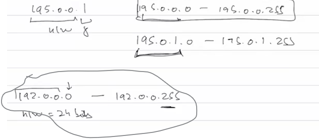

A system was created to make it easier for companies to go and reserve these blocks called

#### Classful Addressing
Depending on requirement of company it can come and reserve one or more blocks from one of these classes 
In reality more of these blocks exist like D and E but that is reserved for special IP addresses
1. Class A (1.0.0.0 - 126.255.255.255)(reserved for huge companies like ibm google, its ver expensive)
   - **Network Part:** 8 bits (first bit is fixed to 0), leaving 7 bits for the network ID.
   - **Number of Networks:** 2^7 = 128. (Networks 0 and 127 are reserved, so there are 126 usable networks).
   - **Host Part:** 24 bits.
   - **Hosts per Network:** 2^24 - 2 = 16,777,214.

2. Class B (128.0.0.0 - 191.255.255.255)
   - **Network Part:** 16 bits (first two bits are fixed to 10), leaving 14 bits for the network ID.
   - **Number of Networks:** 2^14 = 16,384.
   - **Host Part:** 16 bits.
   - **Hosts per Network:** 2^16 - 2 = 65,534.

3. Class C (192.0.0.0 - 223.255.255.255)
   - **Network Part:** 24 bits (first three bits are fixed to 110), leaving 21 bits for the network ID.
   - **Number of Networks:** 2^21 = 2,097,152.
   - **Host Part:** 8 bits.
   - **Hosts per Network:** 2^8 - 2 = 254.
  
When we say the "first 2 bits are fixed to 10" for a Class B address, it refers to the binary representation of the IP address.

An IP address is a 32-bit number, but we usually write it as four decimal numbers (octets). The class of an address is determined by the first few bits of that 32-bit number.

For Class B, the rule is:

The very first bit must be 1.
The second bit must be 0.
This 10 prefix is how any router or device instantly identifies an address as belonging to Class B.

How this creates the decimal range (128-191):
Let's look at the first octet (the first 8 bits):

Minimum Value: The first two bits are 10, and the remaining six bits are all 0.

Binary: 10000000
Decimal: 128 (1*128 + 0*64 + 0*32...)
Maximum Value: The first two bits are 10, and the remaining six bits are all 1.

Binary: 10111111
Decimal: 191 (128 + 0 + 32 + 16 + 8 + 4 + 2 + 1)
So, any IP address starting with a number between 128 and 191 is a Class B address because its binary representation will always start with 10.

But the above system is a bit rigid right, if a company wants to 300 hosts per network they have to move to class B which offers 65000 hosts/devices and waste majority of it, yes we they could buy multiple class c blocks but now they do not have one single network instead they have multiple networks, i mean if they want to have only one singluar network they could combine multiple into one through supernetting but that is not a straight forward process and would cause them to actually handle the network problems that come with it

So, classful addressing has been made obsolete irl with the usage of classless addressing, we'll talk about in further classes, but for now lets assume classful addressing is the norm