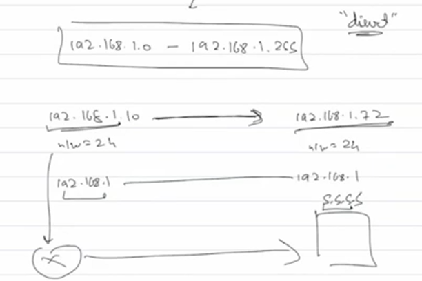

When laptop talks to a device on its own network, it checks the src ip and sees if the network part is the same as its own, and the laptop obviosuly has the info of what its network part is, if its the same then communicates directly otherwise sends data to router which forwards it to server(meaning doesnt go through the router , but there is a device in between, we will talk about it later)

Companies avoid the above kind of architecture since all devices in network might or might not be able to talk to each other but are sure aware of each and every device there is no isolation between them, so a device in one department might be able to talk to a device in another department, even though companies might have security and all why even risk and expose another department's device in the first place

We want isolation also because everything on the same network is broadcasting(sending messages to all devices on the network), devices broadcast a message to other devices for various reasons, ex: 1.when a device joins a network for the first time it dosent know who the router is, so it sends a broadcast message to everyone asking if they are the router and the router sends a message back, 2. when in a network devices talk through mac addresses but when a device is new to the network if it wants to communicate with a specific device it sends out a broadcast message asking for device with ip blabla what is your mac address, every device receives this message and only that device responds back, there are a lot of other reasons why devices keep broadcasting, so for bigger networks like class A or B this is a huge problem since a device has to send  and receive broadcast messages to and from thousands or millions of devices, there are networks set up between buildings as well, so unnecessary traffic and processing

This division/isolation is called SUBNETTING, each network even though they are a part of one big network they act independently and inter network comms happen thorugh router and not directly

# Subnetting

Break a network into sub parts where each sub part is isolated from others

In the below network which has 4 equal subnets, there are 64 devices each

Once we do subnetting the network part changes as well, if the network part of 24 bit network remains the same even after subnetting into lets say 4 equal parts, then the devices assume that devices in other subnet as devices in their own subnet and the isolation does not happen at all 

So the new network part should be 26 bits per 

since the 26 bit network part aint the same now, device sends the message to the router

The first address of a network(ip range)is called the network address and cannot be assigned to any device, this is not the ip of the router

The last address of a network is also reserved as the broadcast address, any device wanting to send a roadcast message, send it on this ip address(explore how)

So always number of devices in a ip/network range is total - 2

Our devices do not directly have these network bits available, instead they have a subnet mask and using that they detemine if someone is on the same network as them

## Subnet mask

Reveals how many bits in the ip address are used for the network by masking the network  part of the ip addr

if the ip has a network part of 24 bits

when we do (ip addr & mask) operation we get the network part which is used by our devices

if network part is 4 bits long, subnet mask is 11110000.00000000.00000000.00000000 -> 240.0.0.0

# Classless inter domain routing
Way to represent subnet mask in a simpler way
After / is number of network bits

After CIDR notation classfull addressing became useless, nobody uses classes a company just comes and asks 192.168.1.0/28