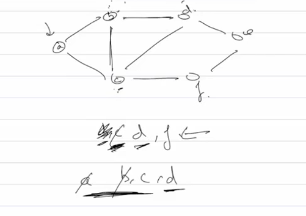
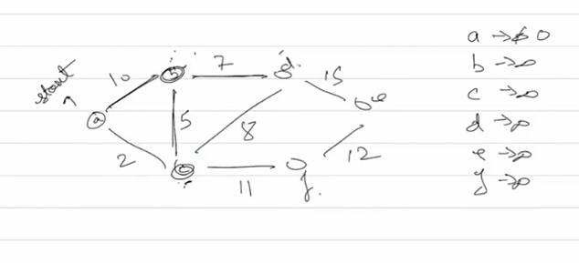
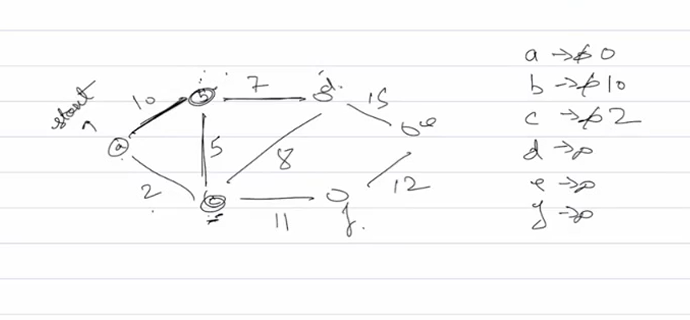
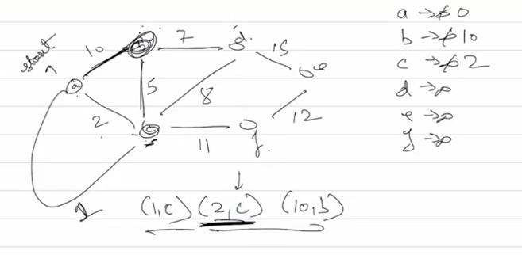
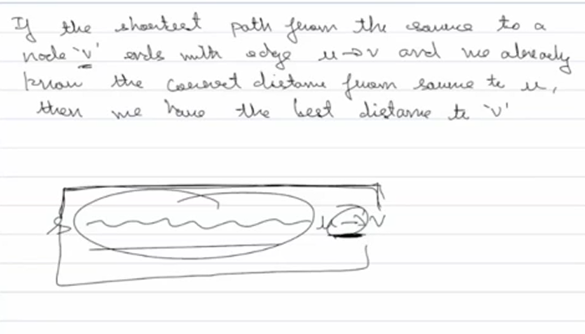
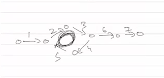
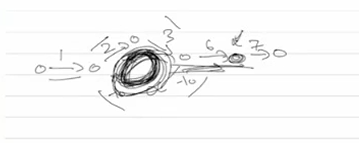

# BFS

Given a graph we are expanding breadth by breadth, does not really mater which node we chose in the next layer to continue but we cant skip a node of an earlier layer and choose the node of the next layer since we are going breadth wise



Can we use bfs to find shortest path incase of a non wighted graph?
Yes, it expands edge by edge covering immediate neighbours first and then moving to others where the distance is number of hops

In case of weighted graph it fails so not applicable in real world, djisktra solves the problem of weghted graphs

# Djikstra's

Expand to neighbours like in bfs but the ordering we choose should include the weights

First assume all vertexes are unreachable except first



Our goal is to relax the edges as in find a path shorter than current

Now we choose the shortest edge which is



in case of c this is the final shortest path, we only mark a node as visited when it is the current node otherwise we just make a record of the node and the current shortest pth, since c is the shortest node we pick it up and mark it as visited confirming the shortest path cause if there was a shorter path it wouldve shown up before like in the image below



the data struct storing node and edge is a priority queue/heap and the data struct containig the curr shortest path is a map

We keep doing this till we reach the destination or visit all nodes, the key thing is once we mark a node as visited we confirm its shortest path since if there was a shorter path it wouldve appeared before this node in the priority queue

## Where does Dijkstra fail?

What if we have negative edge weights? The whole thing breaks

Say we have A to B with weight 5, and A to C with weight 10, then C to B with weight -20

Dijkstra picks A to B (weight 5) first and marks B as visited thinking thats the shortest path, but theres actually A to C to B which is -10, we miss it cause we already finalized B

So once a node is visited dijkstra never reconsiders it, this assumption only works with non negative weights cause if all weights are positive or zero then picking the smallest distance first guarantees its the shortest

Negative weights break this cause a longer initial path could become shorter later through a negative edge

# Bellman Ford

So how do we handle negative weights? We cant be greedy anymore cause we might need to reconsider nodes

Instead of picking the shortest unvisited node each time, just relax ALL edges repeatedly

Why would this work? Think about it - if we relax all edges once, we find all shortest paths of length 1 (single edge). If we relax all edges twice, we find shortest paths using 2 edges. Keep going and eventually we find the shortest path no matter how many edges it uses

How many times do we need to relax? V-1 times where V is number of vertices, cause the longest possible shortest path visits V-1 edges (cant visit same vertex twice without a cycle)

## The Process

Start same as dijkstra - source is 0, everything else infinity

Now instead of using a priority queue, just loop V-1 times and in each loop check EVERY edge

For each edge from u to v with weight w, if distance to u + w is less than current distance to v, update v

Thats it, after V-1 iterations we have shortest paths

Why does this handle negative weights? Cause we keep reconsidering every node through every edge, we dont finalize anything early

## Example Where Dijkstra Fails But Bellman Ford Works

Lets take a simple graph that breaks dijkstra:

```
A -> C (weight 2)
A -> B (weight 5)
B -> C (weight -4)  // negative weight
```

Starting from A, find shortest path to C

### What Dijkstra Does (WRONG):

**Initial state:**

- A: 0 (source)
- Priority queue: [(0, A)]
- B: ∞, C: ∞

**Step 1:** Process A (smallest = 0)

Check neighbors:

- A->C: 0 + 2 = 2, update C to 2
- A->B: 0 + 5 = 5, update B to 5

Mark A as visited
Priority queue: [(2, C), (5, B)]

**Step 2:** Process C (smallest = 2)

C has no outgoing edges
**Mark C as visited and FINALIZED at distance 2**
Priority queue: [(5, B)]

**Step 3:** Process B (only one left)

Check neighbor:

- B->C: 5 + (-4) = 1 < 2, but wait... C is already finalized! Dijkstra ignores this update

Mark B as visited
Done!

**Dijkstra's answer:** Distance to C = 2 (path: A->C)
**WRONG!** Actual shortest path is A->B->C = 5 + (-4) = 1

Dijkstra failed cause it finalized C early at distance 2 and never reconsidered it when it found the better path through B

### What Bellman Ford Does (CORRECT):

**Initial state:**

- A: 0
- B: ∞
- C: ∞

**Iteration 1:**

Check A->C: 0 + 2 = 2, update C to 2
Check A->B: 0 + 5 = 5, update B to 5
Check B->C: 5 + (-4) = 1 < 2, update C to 1

After iteration 1:

- A: 0
- B: 5
- C: 1

**Iteration 2:**

Check all edges again, nothing changes

**Bellman Ford's answer:** Distance to C = 1 (path: A->B->C)
**CORRECT!**

Why did bellman ford get it right? Cause it never finalized C early. It kept checking all edges and when it checked B->C it happily updated C from 2 to 1

The key difference: Dijkstra greedily locked in C at distance 2, bellman ford kept C flexible and found the better path

## Why not always use Bellman Ford?

Its slow, dijkstra with a heap is O((V+E)logV), bellman ford is O(VE) cause we check all E edges V times

If you know weights are non negative just use dijkstra, bellman ford is only needed when you have negative weights or need to detect negative cycles

Real world use? Currency exchange rates can be negative when you account for fees, network routing where costs can decrease, detecting arbitrage opportunities

Data structures? No priority queue needed, just maintain a distance array and iterate through all edges, simpler code but worse performance

## Intuition behind V-1 steps

There's a theorem that exists



We used the same in djikstra

In bellman ford we dont necessarily have the shrortest path in the first iteration

If only one edge is involved we get the shortest path directly, so in the first iteration we have the shortest path if only one edge is involved
In 2 iterations we have the shortest path with 2 edges involved
In 3... and so on

=> In V(vertex)-1 iterations we have the shortest path involving all the edges

If a cycle is introduced the number of edges increase more than v-1, but basic bellman ford v-1 iterations without any additions will work for a positive cycle since it just increases the weight and so no way it will ever have the shortest path



This assumption breaks down in case of a negative cycle which will give a shorter anwer after every extra iteration and finally give -infinity as ans and never find the shortest path



If we do the iteration one more time after v-1 iterations and we get a shorter path, that is only possible in case of a negative cycle