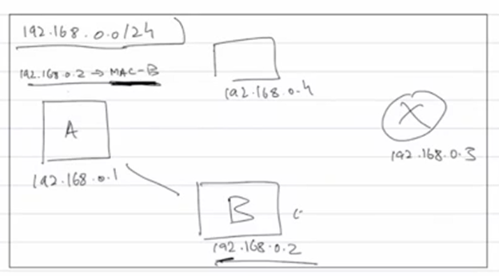
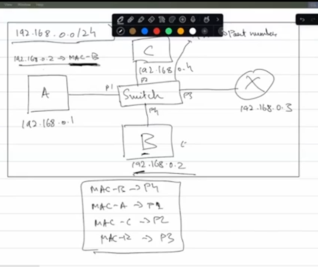

# Media Access Control

Unique identifier for the actual hardware interface
48 bit -> Ex: 1B:00:11:3A:AF
Evry mac addr is globally unique and manufacturers ensure that
Mac addr are usally burnt into the device during manufacturing, but nowadays we can randomise mac from like a software perspective

Any network connection that we can make have some kind of physical hardware associated with it like bluetooth or ethernet or wifi

Help 2 devices on same network talk to each other
We use ip addr to get the mac addr

If we have mac addr why do we need ip addr or vice versa?
Mac addr are constant whereas ip addr are variable(if i reconnect to the router i might get a diff ip) so a device has to keep updating the mapping(going forward the way that we store the mappings it has to be updated even for mac so even though we use this reasoning, one of the actual reasons of why we need both is that mac addresses came first, ip did not exist back then, then networks became more complex hence introduction of ip addr but they decide lets just keep the mac addr too)
So mac addr are used for devices talkimg to each other whereas ip is used for routing(to decide best path from src to dest which contains multiple routers devices and all)

## How data is travelling within a network?

For now we assume that we are only working with a wired connection

Lets say A is a laptop and B is a printer and A knows about B's ip cuase when B first joined the network it sent a broadcast msg saying i am a device that can print stuff here is my ip, to comm with B A now needs its mac addr, so A sends a broadcast msg saying device with B's ip give me your mac addr, only B responds back with its mac addr, now A creates a mapping of ip->mac

But once we have the mac addr its just random pieces of numbers how will we know where to actually send the data, so we have a device called Switch in between that everyone else is connected(wired) to using its actual ports, this switch contains a mapping of mac->port number anf then it sends a signal to the actual device with the data(in or homes the switch is inside the router itself)

For a wireless network, there is no like direct wired connection like if the router sends radiowaves to talk, it's not like router can direct it towards only one device, it can just spead the radio waves in the room and everyone receives it, only the device that it is meant for responds

In wireless connections we require an Access Point(AP), the switch is connected to this access point that sends radiowaves to all the devices along with the mac addr of the device its directed to only that device responds

 