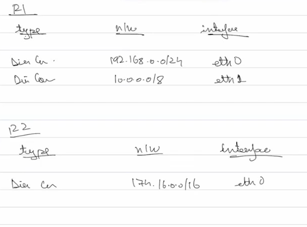

# Routing & forwarding

1. Routing - Process of finding the best path for your data packet
2. Forwarding - Process of moving a packet from one interface to another

## How do we connect these 2 networks?

Before we discuss this, can one router manage both net? This is possible

But in the above diagram there is one error, the ip of the router belongs to only one network so if a device of the other network wants to send data outside its network, it has to do so using the router but the router itself has a dfifferent network part, ip addr of a router has to be of that network. So since each interface can have a ip addr, a router can have multiple interfaces, so one can be assigned to each network the router is handling with the network part of that specififc network

Every router maintains a routing table to manage the transfer of data packets from one location to another

### Routing table

Table that helps move trraffic from one place to another, contains data of many diff kinds

the moment a network like the above image has been created, the below routing table is created by the router

routing table also conatins and stores many other info such as subnet mask and all research about it

another example of a network and its routing table

This routing table is of the direct connections of every device to its router

But now what about the connection between routers how do we represent it? We cant just give one of router 1's interface to map to 3rd network's ip, then they are just directly connected we dont even need the second router, so for these two routers to talk to each other we need them to be directly connected and hence cant use any of the 3 IPs, isntead we use a third interface for R1 and second interface for R2 to create their own network with only 2 routers within so the subnet mask is like /31

Finally, lets see how data travels from one network to another, a device A in 1 wants to talk to a device B in 2, once A finds B is not in same network it directly sends data to the router, router looks at its routing table and does not find any network with the network part of B and so drops the packet, this is a problem since the routing table only contains direcly connected info and dosent know where others are or even if they exist, we have 2 options

1. Static routing table(logging into the router yourself and manually updating routing table)
  In R1 we add B's network address(not ip)

  

  Now R1 knows where to send, R2 receives and sees the network addr in its routing table and sends the data to the switch and to the device, but device B will not be able to send data back in this scenario

2. Dynamic routing table
   We will look at in the next class